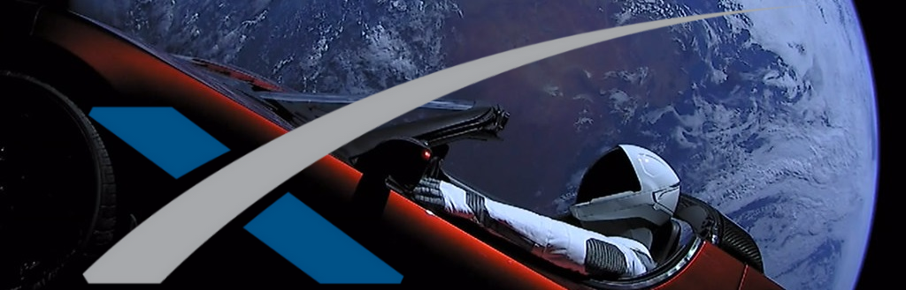

 

<h1><strong>My first REACT front-end application</strong></h1>

Discover the fascinating world of Space X thanks to an API which is full of information on all the feats of this company.
This API is especially for me the opportunity to realize my first front-end application in react.

 

<h2>Motivation</h2>

After having followed the online training on react and read some pages of documentation, I am embarking on this new language which seems so promising.

 

